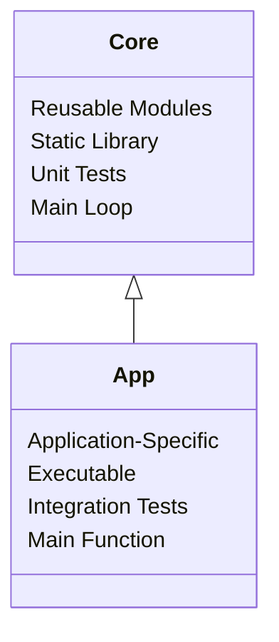

# ProjectTemplate
## The Bocan Online C++ Project Template

A template for C++ projects for Bocan Online and Bocan Studio. 

### Overview

This repository is a start point for developing projects written in C++. It 
uses a monorepo layout featuring an internal static library for core code
(Template-Core) and an application featuring application-specific code 
(Template-App). This architecture is inspired by 
[TheCherno's C++ Architecture](https://github.com/TheCherno/Architecture)
design. This repository  can be used via git clone, or integrated via the 
[Bocan Online Developer Toolkit](https://github.com/BocanOnline/PythonUtilities)
or whatever development workflow that you use.

### Architecture



### Directory Structure

```
.
├── .github                 # github-specific documentation 
├── blog                    # alternate docs location for public publishing
├── CMakeLists.txt          # top-level CMakeLists.txt
├── CMakePresets.json       # defines debug and release configurations
├── CONTRIBUTING.md         # top-level developer specific documentation
├── docs                    # detailed wiki documentation
├── LICENSE.md              # top-level license
├── README.md               # top-level project documentation
├── .gitignore              # default .gitignore for c project
├── .tmuxp.yaml             # tmux config file (requires tmuxp to use)
├── scripts                 # contain helper scripts
│   ├── build-debug.sh      # builds debug config to build-debug/
│   ├── build-release.sh    # builds release config to build-release/
│   ├── clean.sh            # removes build-debug/ and build-release/ directories
│   ├── run-debug.sh        # runs the debug config executable
│   ├── run-release.sh      # runs the release config executable
│   └── run-test.sh         # runs test suite using ctest
├── Template-App            # application-specific code to generate executable
│   ├── CMakeLists.txt      # links to static library, generates executable
│   ├── src                 # application code
│   │   └── main.c          # application entry point
│   └── vendor              # third-party code used in the application
├── Template-Core           # reusable code to generate a static library
│   ├── CMakeLists.txt      # generates a static library and unit tests
│   ├── src                 # library code
│   │   ├── ModuleA.c       # represents a module implementation
│   │   ├── ModuleA.h       # represents a module definition
│   │   └── ModuleA.test.c  # unit test for a module
│   └── vendor              # third-party code used in the library
├── tests                   # integration tests, regression tests, etc.
└── vendor                  # third-party code used in both core and app
```

---

## Using this Template

To begin using this template, the most straightforward method would to use git
clone to bring the repo contents to your local machine. From there you can test 
the build system, edit the files to match your project name, and start 
developing your project. If you need more than one "Core" or more than one
"App" in your project, you will need to make some edits in the CMakeLists.txt
files and add the respective directory structure.


> [!NOTE]
> Need to Haves:
>
> - Git
> - CMake
> - Make (or your build system of choice)
> - Clang (or your C compiler of choice)


> [!NOTE]
> Nice to Haves:
>
> - tmux
> - tmuxp
> - Bocan Online Developer Toolkit (shameless plug)


### 1. Clone the repository to your desired project directory.

```bash
# from the desired parent directory

git clone https://github.com/BocanOnlineTemplates/ProjectTemplate
```

### 2. Rename the project.

In the CMakeLists.txt at the root of the project, change the following line to
reflect the name of your project.

```bash
#[[ ../project_root/CMakeLists.txt ]]
#[[ Change 'Template' to your Project Name ]]

project(Template CXX)
```

You can then edit the Template-App and Template-Core directories and the 
associated files to also match your project name (e.g. NewName-Core and NewName-App).


> [!IMPORTANT] 
> The name of the project in CMake and the names of the project directories (Template-Core and Template-App) must match for CMake to build the project properly.


### 3. Build the project.

This template includes helper scripts to build, run, test, and clean the project. 
These scripts can all be ran from the project root. These scripts require CMake 
to be installed as well as your build system of choice (e.g. Make, Ninja, etc.).

```bash
# setup the scripts as executables, you only need to do this once

chmod +x ./scripts/build-clean.sh \
./scripts/build-debug.sh \
./scripts/build-release.sh \
./scripts/build-test.sh \
./scripts/build-run-debug.sh \
./scripts/build-run-release.sh
```

```bash
# run each script from the project directory

./scripts/clean.sh              # clean all artifacts and delete build directories 
./scripts/build-debug.sh        # build the debug configuration to build-debug/ 
./scripts/build-release.sh      # build the release configuration to build-release/
./scripts/run-test.sh           # run all registered tests with ctest 
./scripts/run-debug.sh          # run the debug binary 
./scripts/run-release.sh        # run the release binary
```

[//]: # (### 4. Developing.)
[//]: # (## Adding Modules to the Library.)
[//]: # (## Adding Third-Party Libraries.)
[//]: # (## Adding Application-Specific Code.)
[//]: # (### 5. Testing.)
[//]: # (## Registering New Tests.)
[//]: # (### 6. Building.)
[//]: # (## Adding New Binaries -Libraries or Executables-.)
[//]: # (## Adding New Build Configurations.)

---

## Documentation

README.md

[CONTRIBUTING.md](/CONTRIBUTING.md)

[//]: # (TODO: Add link to docs/ root to documentation tree.)


### License

This project is published under The Unlicense. 
The code is public domain; use it however you want. 

Full text in [LICENSE.md](/LICENSE.md)
